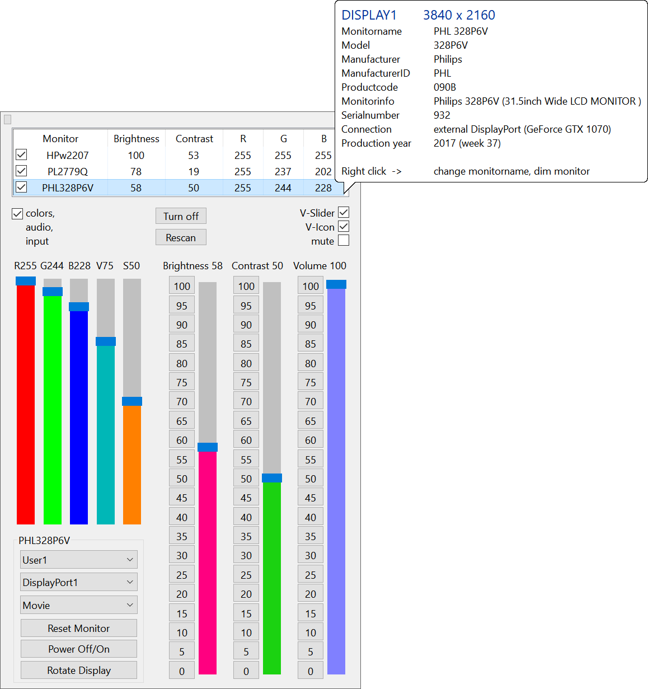
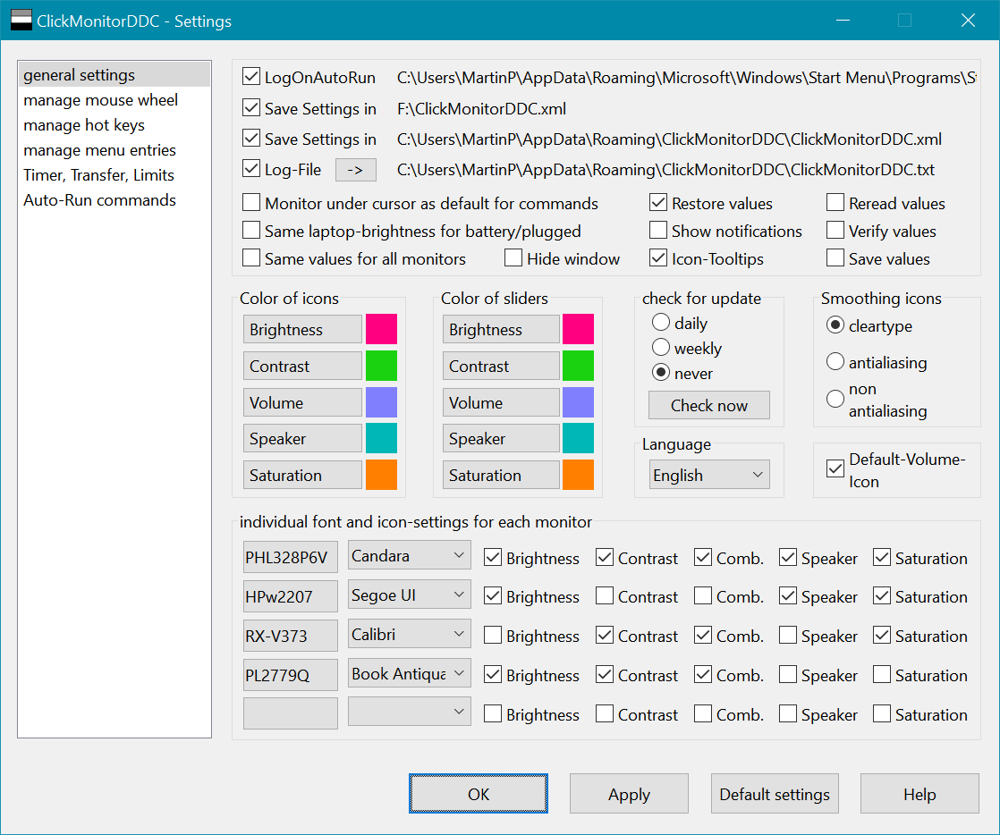
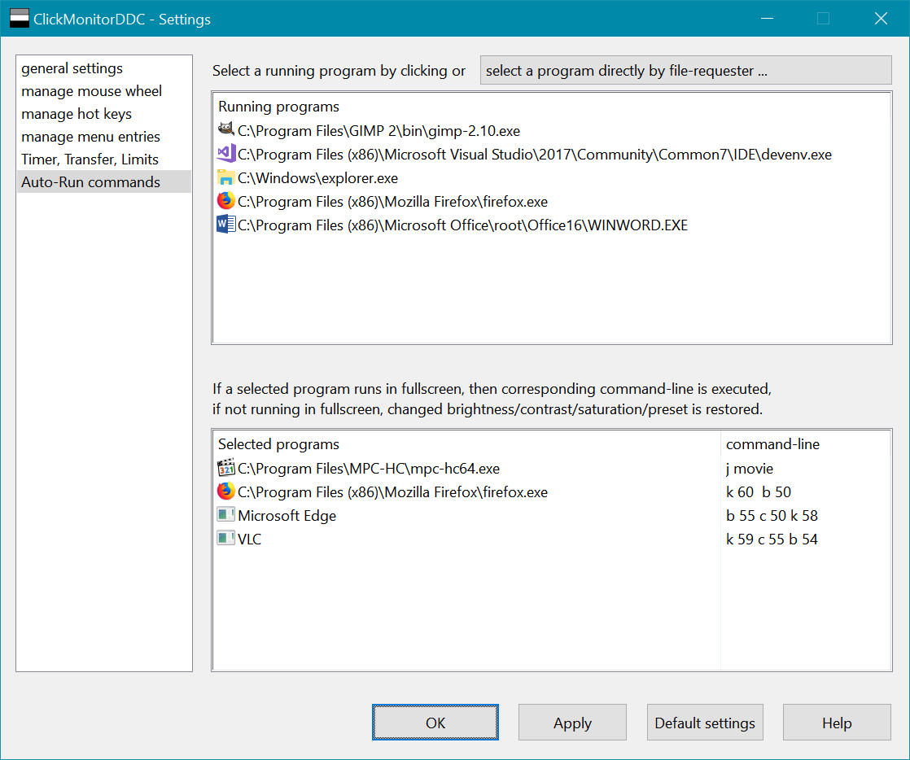
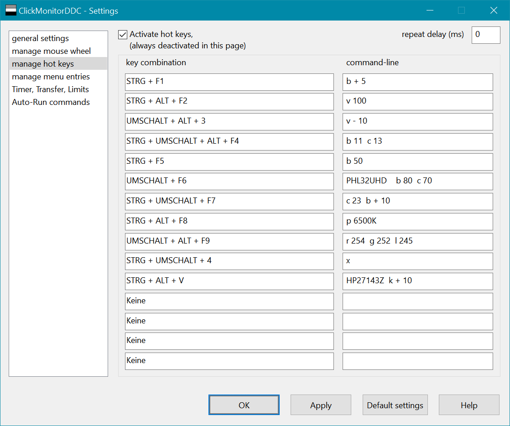
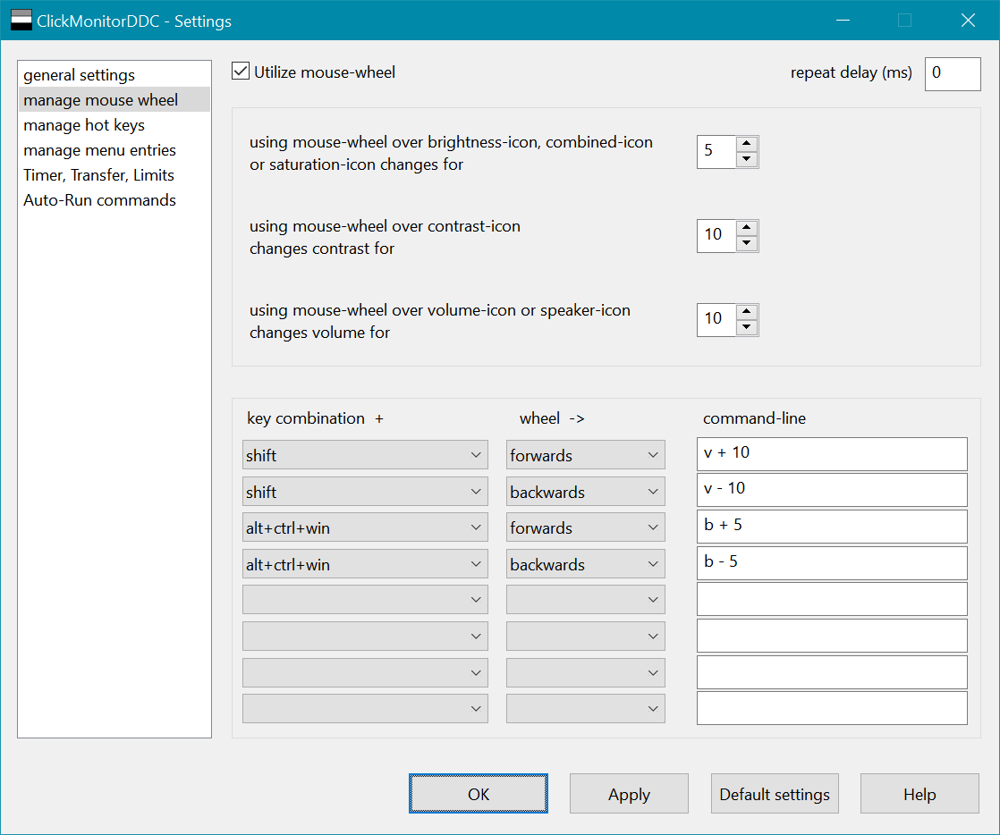
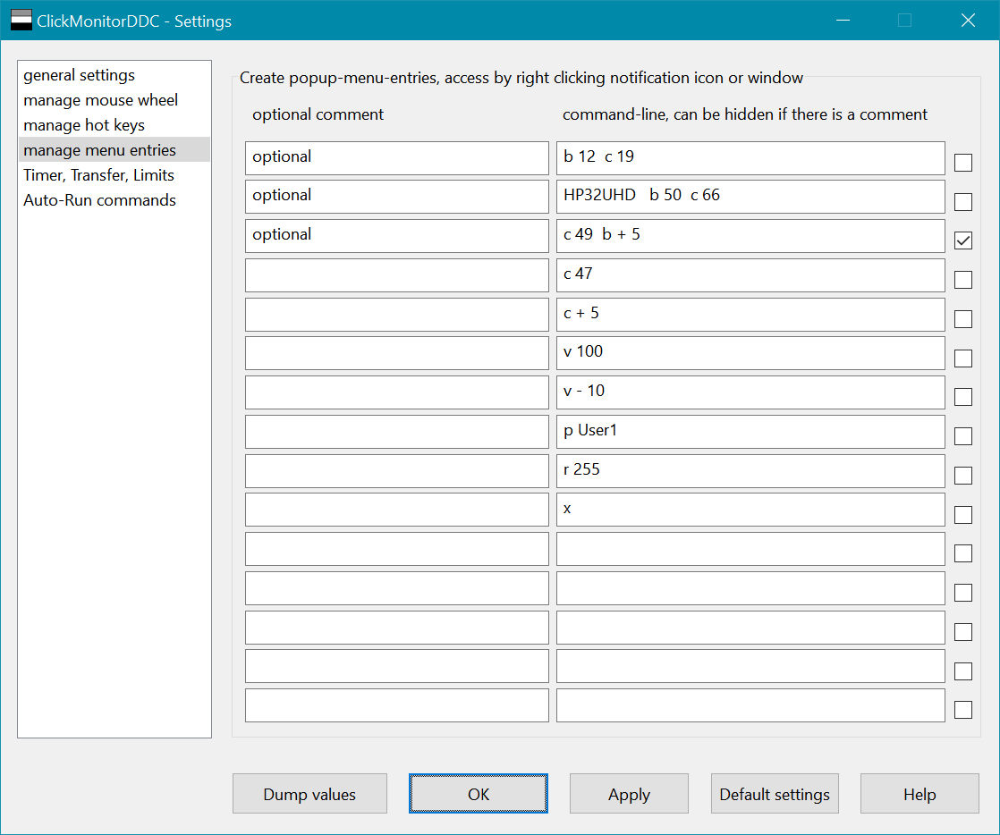

# ClickMonitorDDC 7.2

Click taskbar notification icons to adjust the real monitor-backlight-brightness/contrast
or use mouse wheel over notification icons to increase/decrease corresponding value,
much more comfortable and faster than manually messing around with monitor buttons,
works with external monitors (DDC-protocol) and Laptop-LCD-Display.

The notification icons inform you about the monitor values,
you simply look at the icons to check if the wanted values are already set.
You can change monitor values by using sliders or clicking buttons,
but you can also create powerful command lines, which can be used in batch files
or popup menu entries or be appended in icon properties shortcut target.
Command-lines can also be executed automatically by defined times.
You can define hot keys or mouse wheel combinations for executing command-lines,
this even works in fullscreen-games!
Command-lines can be executed automatically, if selected programs are running in fullscreen,
exiting fullscreen restores original values.

Select a special monitor by prepending monitorname, modelname, serialnumber,
monitornumber or a self-defined monitorname.
PL2779Q b 36 HPA34T c - 5 sets brightness 36 for monitor with name PL2779Q
and decreases actual contrast by 5 for monitor with name HPA34T

You can change color-profiles, select monitor-inputs, reset monitor, power off/on monitor,
dim monitor, set monitor-speaker-volume, set system-volume, rotate display and
set saturation/vibrance.
You can do this by user-interface or by command-arguments.

ClickMonitorDDC requires Windows 7, 8 or 10.
You use this software at your own risk, I disclaim any responsibility for any harm.
You are allowed to use and spread this program for free.

## Screenshots

## Command Line Usage
|:--------:|:-----------------:|----------|--------------------------------------------------------------------------|
| Argument |      optional     |   Value  |                                Description                               |
|     b    |       + or -      |  0 - 100 |                    set brightness (e.g. b 50 or b+50)                    |
|     c    |       + or -      |  0 - 100 |                      set contrast (e.g c 47 or c-47)                     |
|     r    |       + or -      |  0 - 255 |                             set red-luminance                            |
|     g    |       + or -      |  0 - 255 |                            set green-luminance                           |
|     l    |       + or -      |  0 - 255 |                            set blue-luminance                            |
|     p    |                   |   6500k  |            select color-temperature, User for changing colors            |
|     j    |                   | Standard |                      select monitor-specific presets                     |
|     s    |                   |   HDMI1  |              select monitor-input (HDMI,DisplayPort,DVI,VGA)             |
|     k    |       + or -      |  0 - 100 |             sets color-saturation/vibrance in graphics driver            |
|     o    |       + or -      |  0 - 100 |                 sets volume for monitor-speaker/Audio-out                |
|     v    |       + or -      |  0 - 100 |                            sets default-volume                           |
|     m    |                   |          |                           mutes default-volume                           |
|     u    |                   |          |                          unmutes default-volume                          |
|     n    |                   |   0 - 1  |                        disables or enables dimming                       |
|     y    |                   |   0 - 1  |              disables or enables using brightness for target             |
|     ?    |                   |          |            notification for current brightness/contrast/volume           |
|     w    |                   |          |            rotates display orientation clockwise by 90 degrees           |
|     x    |                   |          |                all monitors off (or specify monitorname x)               |
|     f    |                   |          |                 restore default Monitor-factory-settings                 |
|     t    |                   |          | for instance   t b 0 c 0 t b 90 c 80 toggles between b0 c0 and b 90 c 80 |
|     ;    |                   |          |                pauses 100 ms (can be used multiple times)                |
|     ,    |                   |          |                pauses 1000 ms (can be used multiple times)               |
|     #    |                   |          |                      following commands are ignored                      |
|     q    |                   |          |                        terminates ClickMonitorDDC                        |
|     z    |                   |          |                         restarts ClickMonitorDDC                         |
|     !    |                   |          |                   starts any program e.g. ! notepad.exe                  |
|     d    |                   |          |             returns current Monitor-brightness as errorlevel             |
|     e    |                   |          |              returns current Monitor-contrast as errorlevel              |

|        Name        |  Function  | IP Address | Operating System |
|:------------------:|:----------:|:----------:|:----------------:|
| JumpBoxProvisioner |   Gateway  |  10.1.0.4  |       Linux      |
|       ELK-VM       | Monitoring |  10.2.0.5  |       Linux      |
|        Web-1       | Web Server |  10.1.0.5  |       Linux      |
|        Web-2       | Web Server |  10.1.0.6  |       Linux      |
|        Web-3       | Web Server |  10.1.0.11 |       Linux      |

If you are using multiple monitors, you can start command-line with selecting a special monitor, the following arguments will be applied to this selected monitor. 

If you do not select a monitor, the monitor under the cursor can be auto-selected (option in Settings). You can select a monitor by monitorname, modelname, serialnumber, monitornumber or a self-defined monitorname.

If you pause the mouse pointer over the listed monitor there will appear a tooltip-window with modelname, serialnumber and so on, but not all monitors deliver this information.

Monitornumber means position of the listedmonitor, but using monitornumber is not recommended, because sometimes Windows changes positions. If specifying monitorname, modelname or serialnumber, omit spaces, for instance HP w2207 must be written as HPw2207 or use "HP w2207" at least use two chars, so HP would do.

## More Information
For controlling your monitor over monitorcable, a fully functional graphics driver has to be installed, and make sure your monitor
has DDC/CI-protocol enabled, also your monitor must support MCCS (VESA Monitor Control Command Set), but monitors differ
in implementing MCCS, so not all arguments may work, especially selecting color-profiles and inputs are often not fully supported,
besides some monitors offer predefined game and film-modes with fixed values, which prevents some arguments from working.

ClickMonitorDDC is managed by its notification icons, therfore make sure that these icons are not hidden,
but shown on the taskbar notification area. In Windows settings you can select which icons appear on the taskbar.
Or drag and drop icons fom hidden area to taskbar. You can also change the sequence of taskbar icons by drag and drop the icon.

ClickMonitorDDC supports brightness of laptop/notebook-LCD-displays. Laptops have special FN-key-combinations to do this,
nevertheless I implemented support for laptop-brightness, because laptops allow to add an external monitor,
and it would be irritating if ClickMonitorDDC would not show both displays.
ClickMonitorDDC shows values between 0 - 100, which is fine with external monitors,
but some internal LCD-displays support less brightness-levels, the nearest level is chosen automatically.

If you don't prepend a monitorname, modelname or serialnumber in command-lines, then the commands affect the default monitor,
which is the selected monitor in ClickMonitorDDC-window. If you run multiple monitors, then ClickMonitorDDC can set
automatically the monitor under the cursor as default monitor, you can enable this feature in settings.

ClickMonitorDDC can create menu-popup-entries for executing command-lines, if you enter an additional comment,
you can show or hide the corresponding commandline.

ClickMonitorDDC offers in settings an option named 'show notifications'. If you set values directly in ClickMonitorDDC-window,
this option has no effect, but if you press defined hot keys and ClickMonitorDDC-window is invisible,
then setting this option gives you an optical feedback, what the pressed hot key did.

ClickMonitorDDC supports easy to use command-line-arguments, maybe the rarely used toggle-feature needs some extra explanation.
for instance define a hotkey with this commandline
t b 0 c 0 t b 100 c 100
first time you press the hotkey, you set monitor brightness 0 and contrast 0,
second time you press the same hotkey, you will set brightness 100, contrast 100,
third time behaves like first time and so on, this way using one hotkey, you can execute two different profiles in turn.

In settings(Timer,Transfer,Limits), you can define up to 8 times to auto-run-command-lines. Mark checkbox for activating.
If the time-condition is fulfilled then the command-line is executed one-time per day, not permanently like
software-color-filter-gamma-ramp-programs do. ClickMonitorDDC instead changes the real internal monitor-hardware-values.
Monitor-values are stored in EEPROM inside monitor. If EEPROMS are excessively written (at least more than 100000)
they could lose storage-functionality, so more a theoretical issue. But for safety ClickMonitorDDC does not continuously
write to monitor. Also ClickMonitorDDC buffers values, so the same value is only written once to monitor.
Executing auto-command-lines only one time per day allows you still changing values as you want.
07:00 AM b 30
08:00 AM b 40
09:00 AM b 50
07:30 PM b 40
08:20 PM b 30
08:40 PM b 20
If you boot up your computer at 02:00 PM then the nearest past time-command b 50 is executed one-time per day,
at 7:30 PM b 40 will be executed one-time. You can force executing command-line again by restarting ClickMonitorDDC,
really exit and start again or use rescan monitors, simply double-clicking ClickMonitorDDC will have no effect,
because ClickMonitorDDC does not start again, if already running.
Alternatively entering and leaving ClickMonitorDDC-settings will also check and run auto-run-command-line.
You could also execute command-lines with multiple arguments
07:00 AM b 10 c 20 l 250
08:00 AM b 20 c 25 l 252
This would increase brightness, contrast and blue-luminance.

Controlling monitor is done by VCP-codes defined by MCCS (VESA Monitor Command Control Set),
ClickMonitorDDC makes the useful VCP-codes available by User-Interface or by commandline-arguments,
nevertheless there are two general arguments,
e.g.  getVCP 0x12         shows actual and maximum contrast in a messagebox
e.g.  get_VCP 0x12        returns actual VCP code value as errorlevel
e.g.  setVCP 0x10    50  sets monitor-brightness to 50, same as b 50
e.g.  setVCP 0x10 + 10  increases actual monitor-brightness by 10, same as b + 10
but you should not use setVCP or getVCP, because in rare cases it could harm your monitor,
if you really want to dig deeper in VCP-codes, then use softMCCS from EnTech Taiwan and read MCCS-documentation.